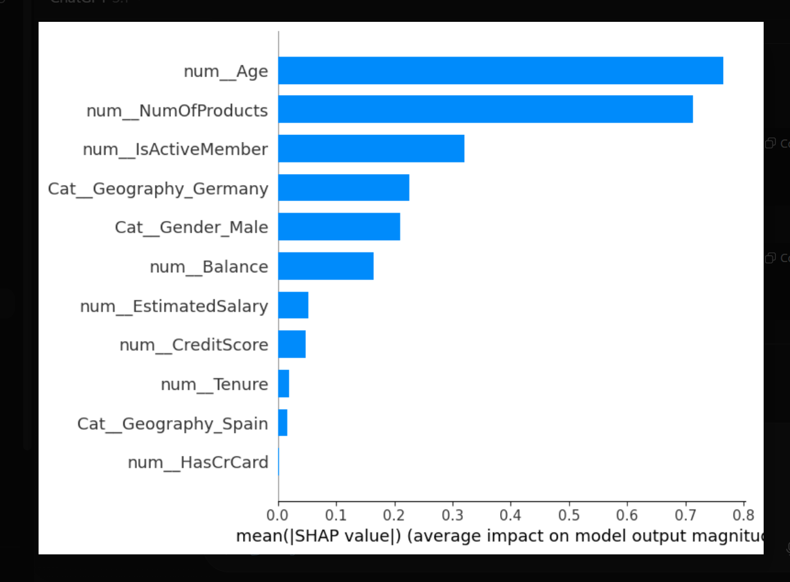
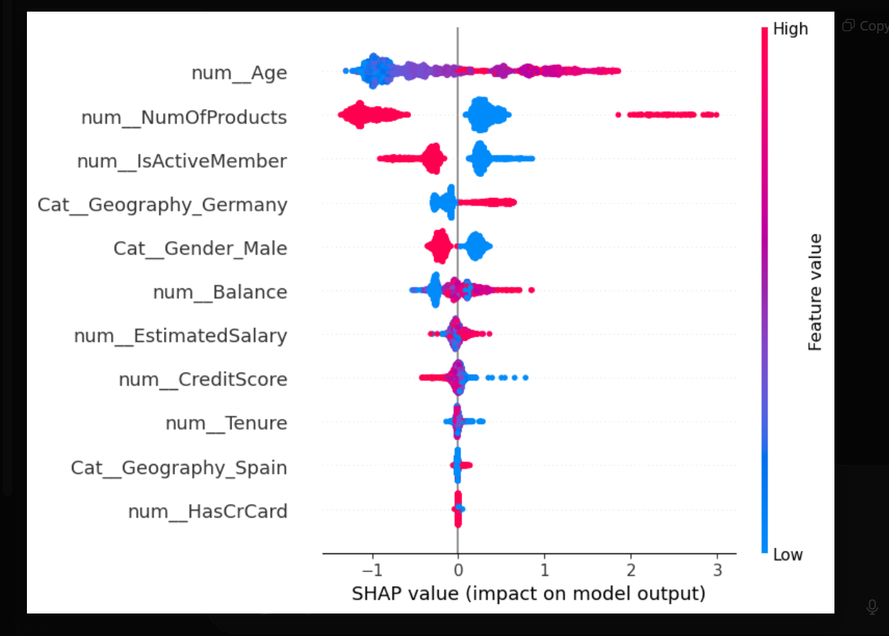

<p align="center">
  
</p>

# 📊 Bank Customer Churn Prediction

End-to-end Machine Learning project to predict bank customer churn using **XGBoost**, **SHAP**, and **Streamlit**.

---

## 🚀 Project Overview
This project predicts whether a bank customer will **churn (exit)** using Machine Learning.  
The model is trained on real customer data and explains *why* a customer is likely to leave using **SHAP interpretability**.

---

## 🧠 Live ML Stack Includes:
- `Feature engineering`
- `OneHotEncoder + StandardScaler pipeline`
- `Logistic Regression, RandomForest, XGBoost`
- `SHAP explainability`
- `Streamlit UI`

---

## 📁 Project Structure
```
Bank_Customer_Churn_Prediction/
│── app/                  # Streamlit UI
│── data/                 # Dataset
│── models/               # Saved model + preprocessor
│── notebooks/            # Main Jupyter notebook
│── src/                  # Optional python modules
│── README.md             # Project documentation
```

---

## 📊 Dataset
- **File:** `Churn_Modelling.csv`
- **Rows:** 10,000
- **Target:**
  - `1` → Customer Churned  
  - `0` → Customer Stayed  

---

## 🛠 Technologies Used
- Python  
- Pandas, NumPy  
- Matplotlib, Seaborn  
- Scikit-Learn  
- XGBoost  
- SHAP  
- Streamlit  

---

## 🧩 Modeling Approach

### ✔ Preprocessing
- OneHotEncoder for categorical variables  
- StandardScaler for numerical variables  
- ColumnTransformer pipeline  

### ✔ Models Compared

| Model                | Accuracy | Recall (Churn) | ROC-AUC |
|----------------------|----------|----------------|---------|
| Logistic Regression  | 0.80     | 0.18           | 0.57    |
| Random Forest        | 0.86     | 0.45           | 0.71    |
| ⭐ **XGBoost**        | **0.80** | **0.76**       | **0.87** |

### 👉 XGBoost is the final chosen model because it captures churn patterns best.

---

## 📈 Feature Importance (XGBoost)
Top churn drivers:
- `NumOfProducts`
- `Age`
- `IsActiveMember`
- `Geography_Germany`
- `Balance`
- `Gender`

---

## 🔍 Explainability with SHAP

### What SHAP reveals:
- Customers with **only 1 product** → high churn risk  
- **Older** customers → more churn  
- **Inactive** members → high churn  
- **Germany** customers → highest churn  
- **Higher balance** → more likely to churn  

### Visuals included:
- SHAP Summary plot  
- SHAP Bar plot  
- SHAP Dependence plots  
- SHAP Waterfall (single-customer explanation)  

---

## 🏦 Business Recommendations
✔ Cross-sell for single-product users  
✔ Improve engagement for inactive users  
✔ Region-specific retention campaigns  
✔ Dedicated RM (Relationship Manager) for high-balance customers  

---

## 🌐 Streamlit App

A clean UI that predicts churn based on customer details:
- Age  
- Products  
- Geography  
- Activity  
- Salary  
- Balance  
- Credit Score  

### Run locally:
```
streamlit run app/app.py
```

---

## 📸 Project Screenshots

### **Streamlit UI (Top)**


---

### **Streamlit UI (Bottom)**


---

### **XGBoost Feature Importance**


---

### **SHAP Summary Plot**



## ✅ Conclusion
This project delivers:
- A full ML workflow  
- High-performing model  
- Business-centered insights  
- Streamlit UI  
- Explainability using SHAP  

**A perfect portfolio project for ML/Data Science roles.**

---
